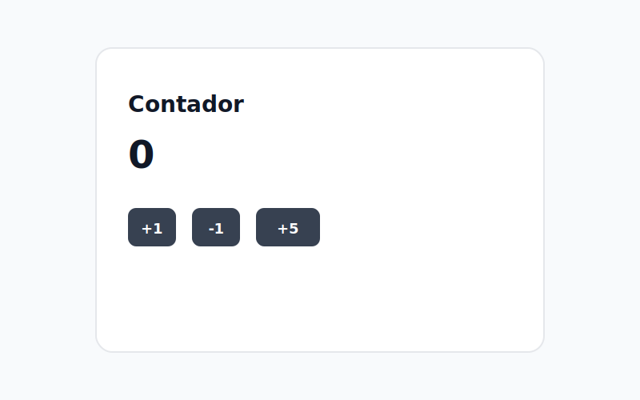

# Calculator — Proyecto de práctica con Redux Toolkit



Descripción
---------

Este es un proyecto pequeño creado para practicar el uso de Redux Toolkit con React y TypeScript. Implementa un contador simple con acciones para incrementar, decrementar y aumentar el contador por una cantidad dada.

Tecnologías y frameworks
------------------------

<p align="left">
	<a href="https://skillicons.dev">
		
	</a>
</p>

- **React** — Biblioteca para construir la interfaz de usuario.
- **Vite** — Herramienta de construcción y servidor de desarrollo rápido.
- **TypeScript** — Tipado estático para mayor seguridad y autocompletado.
- **Redux Toolkit** — Simplifica la configuración de Redux (slices, store, etc.).
- **React Redux** — Conecta React con Redux.

Estructura principal
--------------------

- `src/features/counter/` — Slice(s) del contador (`counterSlice.ts`, `counterSlices.ts`).
- `src/Redux/store.ts` — Configuración del store de Redux y tipos `RootState`/`AppDispatch`.
- `src/App.tsx` — Componente principal que usa `useSelector` y `useDispatch`.

Qué incluye este proyecto
-------------------------

- Slice del contador con acciones: `incrementar`, `decrementar`, `incrementarPorMonto`.
- Tipado del store: `RootState` y `AppDispatch` para usar con `useSelector` y `useDispatch`.
- Ejemplo de componente que despacha acciones y muestra el valor actual.

Cómo ejecutar
-------------

Instala dependencias y arranca el servidor de desarrollo:

```bash
npm install
npm run dev
```

Propósito
---------

Este repositorio sirve como espacio de práctica para entender y dominar conceptos de Redux Toolkit integrados con React y TypeScript: creación de slices, exportación de acciones y reducers, integración en el store, y tipado seguro del estado global.

Si quieres, puedo:

- Añadir instrucciones para pruebas unitarias o e2e.
- Generar una captura real automáticamente (requiere ejecutar la app y tomar screenshot).
- Añadir un archivo `CONTRIBUTING.md` o plantillas de commit.

— Fin —
